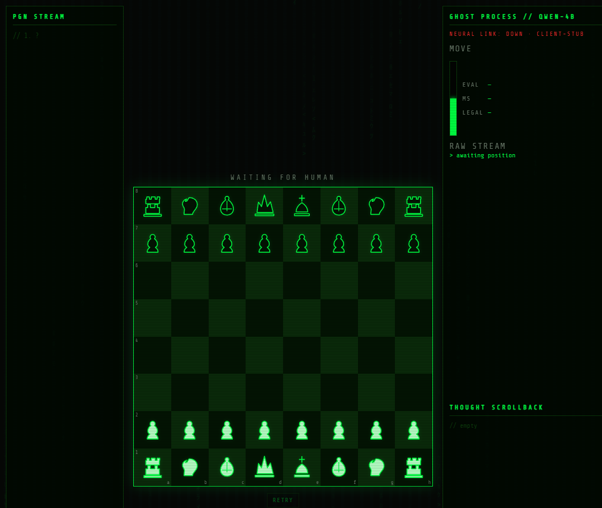

# chess-llm

Fine-tune **Qwen3-4B** on Stockfish-labeled chess (QLoRA SFT, optional GRPO) and play it in a local Matrix-style UI.



## Project goal

This educational project tries to teach a open small language model to look at a chess position and choose a strong next move. It also explores how far a single consumer RTX 5060 Ti 16GB can realistically go when fine-tuning and running a 4-billion-parameter model locally.

This repo is **code only**. Labels, adapters, and logs are gitignored — you generate data and train on your machine.

## Getting started

**Need:** a NVIDIA GPU with enough VRAM for 4-bit 4B QLoRA (16GB is enough), Python 3.11, Node 18+ for the UI. On **Windows, use WSL2 Ubuntu** (native Windows Unsloth/CUDA is not the path we used). Do not install a Linux NVIDIA driver; WSL uses the Windows driver.

```bash
git clone https://github.com/K-bhuvan/chess-llm.git
cd chess-llm
```

**1. Env (Linux / WSL)**

```bash
source ~/miniforge3/etc/profile.d/conda.sh   # or miniconda
conda activate llm_gpu                       # or: bash scripts/setup_wsl.sh
pip install -e ".[dev]"
bash scripts/install_unsloth_blackwell.sh    # do not `pip install unsloth` unconstrained
python scripts/gpu_smoke.py                  # expect cuda available
```

**2. Data — build the parquet files (they are not in git)**

Stay in the **repo root**, with the same conda env as step 1 (`llm_gpu`). Hugging Face will download **shards** of [Lichess/chess-position-evaluations](https://huggingface.co/datasets/Lichess/chess-position-evaluations) as it streams; you do **not** download the entire 40GB+ dump.

```bash
cd /path/to/chess-llm
export PYTHONPATH=src
python -m chess_llm.data.sample --out-dir data --min-depth 20 --sample-mod 1
```

What that command does:

- Reads positions from Lichess (Stockfish evals, **CC0**).
- Keeps a row only if Stockfish **depth ≥ 20**, the FEN is new, and the first PV move is **legal**.
- Writes four files under `data/`:

| File | Rows | Role |
|---|---:|---|
| `data/train.parquet` | 2,000,000 | SFT |
| `data/val.parquet` | 20,000 | SFT eval (optional) |
| `data/test.parquet` | 20,000 | metrics after train |
| `data/rl.parquet` | 50,000 | GRPO/DPO |

First-time run can take **tens of minutes** (network + filter). You are done when all four files exist:

```bash
ls -lh data/*.parquet
```

Tiny dataset to test the sampler only (not for real training):

```bash
python -m chess_llm.data.sample --out-dir data --train 800 --val 100 --test 100 --rl 100 --sample-mod 1
```

**3. Train — SFT then GRPO (GPU, still in WSL)**

You need `data/train.parquet` from step 2. Run from the **repo root**, conda env on, GPU visible (`nvidia-smi`).

**3a. Optional 1-minute smoke** (proves Unsloth + CUDA; does **not** make a chess model):

```bash
export PYTHONPATH=src
export UNSLOTH_SKIP_TORCHVISION_CHECK=1
python -m chess_llm.train.sft --config configs/sft.yaml --max-samples 32
python -m chess_llm.train.grpo --config configs/grpo.yaml --max-samples 8 --max-steps 1
```

**3b. Real run** (this is the one that takes hours):

```bash
bash scripts/train_full.sh
```

That script, in order:

1. **SFT** — QLoRA on Qwen3-4B, **`max_steps: 4000`** in `configs/sft.yaml` (~5–10 hours on a 16GB 5060 Ti). Checkpoints every 500 steps under `~/chess_outputs/sft/` (e.g. `checkpoint-500`, `checkpoint-1000`, … `checkpoint-4000`).
2. Copies those adapters into the repo `outputs/sft/`.
3. **GRPO** — 20k RL rows, 1000 steps (~8–16 extra hours). Writes `~/chess_outputs/grpo/`, then `outputs/grpo/`.
4. Writes `outputs/eval.json` on 2k test positions.

Log (live):

```bash
tr -d '\000' < ~/chess_outputs/train_full.log | tail -n 40
```

You want lines like `501/4000` and `'loss': '0.65'`. If GRPO runs out of VRAM, skip it and run DPO instead:

```bash
export PYTHONPATH=src
python -m chess_llm.train.dpo --config configs/dpo.yaml
```

Do **not** start two `train_full.sh` jobs at once (they will fight for the GPU). Windows: `scripts/watchdog.ps1` keeps the PC awake and resumes from the last **complete** checkpoint if a save hangs.
**4. Play**

```bash
python -m chess_llm.serve     # WSL/GPU; legal stub until adapters exist
cd web && cp .env.example .env.local && npm install && npm run dev
```

Open http://localhost:3000. Tests: `pytest`.

## GPU / machine (what we trained on)

| | |
|---|---|
| GPU | NVIDIA GeForce **RTX 5060 Ti 16GB** (Blackwell, compute **sm_120**) |
| System RAM | **32GB**; WSL cap **24GB** + 8GB swap |
| OS | Windows 11 + **WSL2 Ubuntu** |
| Torch | **2.12 + cu128** (50-series needs this, not default cu126) |
| SFT VRAM | ~**7–10GB** of 16GB (4-bit Qwen + LoRA, seq 256) |
| GPU load | ~**98%**, ~**155W** / 180W, ~**70°C** |

A 16GB card is the intended size. Smaller VRAM: drop `per_device_train_batch_size` or `lora_r` in `configs/sft.yaml`.

## Training recipe (what we actually run)

1. **Labels:** Lichess Stockfish evals, **depth ≥ 20**, unique FEN, legal first PV move. Target text: `e2e4 cp:35` or `e7e8q mate:1` (eval from the side to move). Dataset is **CC0**; Stockfish the engine is GPL and is **not** shipped.
2. **Base model:** `unsloth/Qwen3-4B-Instruct-2507`, **4-bit QLoRA**, `lora_r=16`, `lora_alpha=16` on q/k/v/o + MLP (~33M trainable / 4.05B).
3. **SFT:** packing, `max_seq_length=256`, batch **4**, grad accum **8** (effective 32). Packed 2M rows → 853k sequences. We **do not** run a full epoch (that is ~26.7k steps / ~3 days). **`max_steps: 4000`** (~5–10h on this GPU). Checkpoints every **500** steps; saves are **adapters only** (a full optimizer dump hung WSL’s GPU driver once).
4. **RL:** short **GRPO** on 20k holdout positions, 1000 steps (legal / PV / eval rewards). If that OOMs: **DPO** (Stockfish move vs random legal).
5. **Then:** `python -m chess_llm.serve` loads `outputs/grpo` or `outputs/sft`.

Configs: `configs/sft.yaml`, `configs/grpo.yaml`, `configs/dpo.yaml`. Checkpoints default to `$HOME/chess_outputs` in WSL, then copy into `outputs/`.

Windows unattended helper (sleep off, resume if a save hangs): `scripts/watchdog.ps1`.

## License notes

| | |
|---|---|
| Lichess eval dump | **CC0 1.0** — train locally; we do not push parquet |
| Stockfish | **GPL-3** — engine not in this repo |
| Qwen3-4B-Instruct | Apache-2.0 — base weights downloaded at train time; adapters not in git |
